# Healthcare Data Analysis

## 📌 Project Overview

This project analyzes healthcare data from a fictional **CityCare Hospital** to uncover meaningful insights into patient demographics, hospital admissions, medical expenses, insurance coverage, doctor workload, readmissions, laboratory testing, and department performance.

The project follows an end-to-end **SQL data analytics workflow using PostgreSQL**.

The healthcare dataset consists of multiple related tables including patient information, doctor information, hospital admissions, and laboratory test records. SQL is used to connect these tables and answer real-world healthcare business questions.

The main objective of this project is to transform raw healthcare data into **meaningful insights that can help hospital management understand operational performance, patient trends, healthcare costs, and areas requiring attention.**

---

# 🎯 Project Objectives

- Analyze patient demographics and age distribution.
- Understand hospital admission patterns.
- Compare Emergency, Urgent, and Elective admissions.
- Analyze average medical expenses across departments.
- Identify monthly admission trends.
- Analyze doctor workload based on admissions handled.
- Evaluate insurance coverage and remaining patient expenses.
- Calculate department-wise readmission rates.
- Identify laboratory tests with the highest testing costs.
- Analyze common diagnoses across departments.
- Identify patients with above-average total medical expenses.
- Analyze month-over-month changes in medical expenses.
- Create a department performance report.
- Identify departments requiring greater management attention.
- Generate actionable recommendations from healthcare data.

---

# 🛠️ Tools & Technologies

| Tool / Technology | Purpose |
|---|---|
| **SQL** | Data analysis and business problem solving |
| **PostgreSQL** | Database management and SQL analysis |
| **pgAdmin 4** | PostgreSQL database environment |
| **Python** | Dataset generation and data preparation |
| **Pandas** | Data handling and preprocessing |
| **Excel** | Dataset storage and inspection |
| **Git & GitHub** | Version control and documentation |

---

# 🔄 Project Workflow

```text
Healthcare Dataset
        ↓
Data Exploration
        ↓
Data Preparation
        ↓
Create PostgreSQL Tables
        ↓
Load Healthcare Data
        ↓
SQL Business Analysis
        ↓
Business Insights
        ↓
Department Performance Analysis
        ↓
Data-Driven Recommendations
```

---

# 1️⃣ Data Preparation

The healthcare dataset was prepared before performing SQL analysis.

The dataset contains information about:

- Patients
- Doctors
- Hospital admissions
- Laboratory tests

### Data preparation steps included:

- Creating a synthetic healthcare dataset.
- Generating patient records.
- Generating doctor records.
- Generating hospital admission records.
- Generating laboratory test records.
- Maintaining relationships between related tables.
- Checking primary key and foreign key relationships.
- Preparing the datasets for PostgreSQL.
- Importing the datasets into PostgreSQL.
- Verifying the imported records before performing analysis.

---

# 2️⃣ Database Setup

PostgreSQL was used to store and analyze the healthcare data.

The project contains **four related tables**:

```text
patients
    │
    └──────────────┐
                   ↓
              admissions
                   │
                   ├──────────────→ doctors
                   │
                   ↓
              lab_tests
```

## 🗄️ Database Tables

| Table | Description | Records |
|---|---|---:|
| `patients` | Patient demographic information | 5,000 |
| `doctors` | Doctor information and departments | 12 |
| `admissions` | Hospital admission and treatment information | 5,000 |
| `lab_tests` | Laboratory testing information | 8,000 |

---

## 👤 Patients Table

The `patients` table stores demographic information about hospital patients.

```sql
CREATE TABLE patients (
    patient_id VARCHAR(10) PRIMARY KEY,
    age INT,
    gender VARCHAR(10),
    city VARCHAR(50),
    blood_group VARCHAR(5)
);
```

### Columns

| Column | Description |
|---|---|
| `patient_id` | Unique patient identifier |
| `age` | Patient age |
| `gender` | Patient gender |
| `city` | Patient city |
| `blood_group` | Patient blood group |

---

## 👨‍⚕️ Doctors Table

The `doctors` table stores information about doctors working in different departments.

```sql
CREATE TABLE doctors (
    doctor_id VARCHAR(10) PRIMARY KEY,
    doctor_name VARCHAR(100),
    department VARCHAR(50)
);
```

### Columns

| Column | Description |
|---|---|
| `doctor_id` | Unique doctor identifier |
| `doctor_name` | Name of doctor |
| `department` | Doctor's department |

---

## 🏥 Admissions Table

The `admissions` table contains information about hospital admissions, treatments, expenses, insurance, and patient satisfaction.

```sql
CREATE TABLE admissions (
    admission_id VARCHAR(10) PRIMARY KEY,
    patient_id VARCHAR(10),
    admission_date DATE,
    discharge_date DATE,
    department VARCHAR(50),
    diagnosis VARCHAR(100),
    treatment VARCHAR(100),
    doctor_id VARCHAR(10),
    insurance_provider VARCHAR(100),
    admission_type VARCHAR(20),
    room_type VARCHAR(30),
    length_of_stay INT,
    medical_expenses NUMERIC(12,2),
    insurance_coverage NUMERIC(12,2),
    patient_satisfaction NUMERIC(2,1),
    readmission VARCHAR(5),
    follow_up_required VARCHAR(5),

    CONSTRAINT fk_admission_patient
        FOREIGN KEY (patient_id)
        REFERENCES patients(patient_id),

    CONSTRAINT fk_admission_doctor
        FOREIGN KEY (doctor_id)
        REFERENCES doctors(doctor_id)
);
```

### Columns

| Column | Description |
|---|---|
| `admission_id` | Unique admission identifier |
| `patient_id` | Patient associated with admission |
| `admission_date` | Date of admission |
| `discharge_date` | Date of discharge |
| `department` | Hospital department |
| `diagnosis` | Patient diagnosis |
| `treatment` | Treatment provided |
| `doctor_id` | Doctor handling the admission |
| `insurance_provider` | Insurance provider |
| `admission_type` | Emergency, Urgent, or Elective |
| `room_type` | Type of hospital room |
| `length_of_stay` | Number of days stayed |
| `medical_expenses` | Total medical expenses |
| `insurance_coverage` | Amount covered by insurance |
| `patient_satisfaction` | Patient satisfaction score |
| `readmission` | Whether the patient was readmitted |
| `follow_up_required` | Whether follow-up is required |

---

## 🧪 Lab Tests Table

The `lab_tests` table contains information about laboratory tests performed during hospital admissions.

```sql
CREATE TABLE lab_tests (
    test_id VARCHAR(10) PRIMARY KEY,
    admission_id VARCHAR(10),
    patient_id VARCHAR(10),
    test_name VARCHAR(100),
    test_date DATE,
    test_result VARCHAR(20),
    test_cost NUMERIC(10,2),

    CONSTRAINT fk_lab_admission
        FOREIGN KEY (admission_id)
        REFERENCES admissions(admission_id),

    CONSTRAINT fk_lab_patient
        FOREIGN KEY (patient_id)
        REFERENCES patients(patient_id)
);
```

### Columns

| Column | Description |
|---|---|
| `test_id` | Unique laboratory test identifier |
| `admission_id` | Admission associated with the test |
| `patient_id` | Patient associated with the test |
| `test_name` | Name of laboratory test |
| `test_date` | Date of test |
| `test_result` | Test result |
| `test_cost` | Cost of laboratory test |

---

# 3️⃣ SQL Business Analysis

SQL was used to answer real-world healthcare business questions related to patients, hospital admissions, doctors, insurance, medical expenses, readmissions, laboratory testing, and department performance.

Each analysis follows the structure:

**📝 SQL Problem → 💻 Solution Query → 📤 Output → 💡 Insight**

---

# 📊 Business Problems & Solutions

# 🟢 Basic Level

## 1. Patients by Gender and Average Age

### 📝 SQL Problem

Find the number of patients by gender and calculate the average age for each gender.

This analysis helps understand the demographic distribution of patients across different genders.

### 💻 Solution Query

```sql
SELECT
    gender,
    COUNT(*) AS total_patients_by_gender,
    ROUND(AVG(age), 2) AS avg_age_by_gender
FROM patients
GROUP BY gender
ORDER BY total_patients_by_gender DESC;
```

### 📤 Output

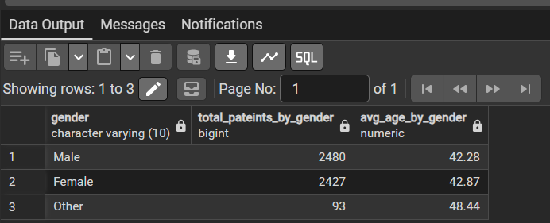

### 💡 Insight

Male patients are the largest group with 2,480 patients, followed by 2,427 females. The average age is similar for males and females, while the Other category has the highest average age at 48.44 years.

---

## 2. Admissions and Average Length of Stay by Department

### 📝 SQL Problem

Find the total number of admissions and the average length of stay for each department.

This analysis helps compare patient volume and average hospital stay across departments.

### 💻 Solution Query

```sql
SELECT
    department,
    COUNT(admission_id) AS total_admissions,
    ROUND(AVG(length_of_stay), 2) AS avg_length_of_stay
FROM admissions
GROUP BY department
ORDER BY total_admissions DESC;
```

### 📤 Output

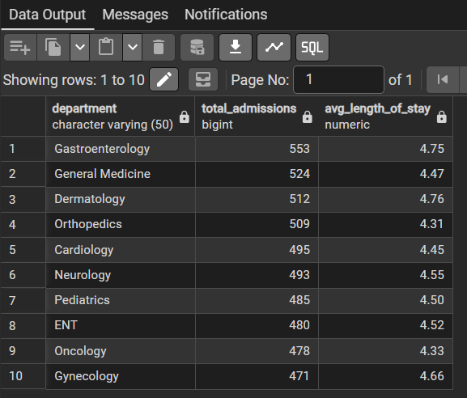

### 💡 Insight

Gastroenterology has the highest number of admissions with 553, while Gynecology has the lowest with 471 among the displayed departments. Average length of stay remains relatively consistent, ranging from 4.31 to 4.76 days.
---

## 3. Admissions by Admission Type

### 📝 SQL Problem

Find the number and percentage of admissions for each admission type:

- Emergency
- Urgent
- Elective

This analysis helps understand the distribution of hospital admissions based on their urgency.

### 💻 Solution Query

```sql
SELECT
    admission_type,
    COUNT(*) AS total_admissions,
    ROUND(
        COUNT(*) * 100.0
        / SUM(COUNT(*)) OVER(),
        2
    ) AS percentage_per_category
FROM admissions
GROUP BY admission_type
ORDER BY total_admissions DESC;
```

### 📤 Output

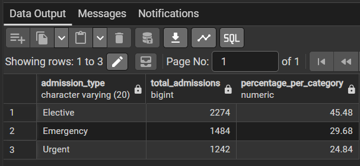

### 💡 Insight

Elective admissions account for the largest share (45.48%), followed by Emergency (29.68%) and Urgent (24.84%). This indicates that planned admissions make up nearly half of the hospital's admissions.

---

## 4. Departments with Average Medical Expense Above ₹30,000

### 📝 SQL Problem

Find the departments where the average medical expense per admission is greater than ₹30,000.

This analysis identifies departments with relatively high average medical expenses.

### 💻 Solution Query

```sql
SELECT
    department,
    ROUND(AVG(medical_expenses), 2) AS avg_medical_expense
FROM admissions
GROUP BY department
HAVING AVG(medical_expenses) > 30000;
```

### 📤 Output

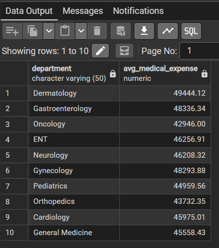

### 💡 Insight

All departments have an average medical expense above ₹30,000. Dermatology has the highest average expense at ₹49,444.12, while General Medicine has the lowest among the displayed departments at ₹45,558.43.

---

## 5. Monthly Admission Trend

### 📝 SQL Problem

Find the total number of admissions for each month.

This analysis helps identify monthly patterns in hospital admission volume.

### 💻 Solution Query

```sql
SELECT
    EXTRACT(MONTH FROM admission_date) AS month,
    COUNT(*) AS total_admissions_per_month
FROM admissions
GROUP BY 1
ORDER BY 1;
```

### 📤 Output

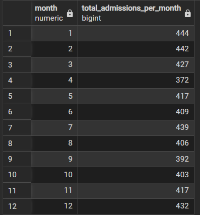

### 💡 Insight

Admissions are highest in January (444) and gradually decrease until September (392). Admissions then show a moderate increase toward the end of the year, reaching 432 in December.

---

# 🟡 Intermediate Level

## 6. Admission Details with Patient and Doctor Information

### 📝 SQL Problem

Display each admission along with the patient's ID, age, gender, department, diagnosis, and doctor's name.

This analysis demonstrates how multiple healthcare tables can be joined to create a consolidated admission-level report.

### 💻 Solution Query

```sql
SELECT
    a.patient_id,
    p.age,
    p.gender,
    a.department,
    a.diagnosis,
    d.doctor_name
FROM patients AS p
INNER JOIN admissions AS a
    ON p.patient_id = a.patient_id
INNER JOIN doctors AS d
    ON a.doctor_id = d.doctor_id;
```

### 📤 Output

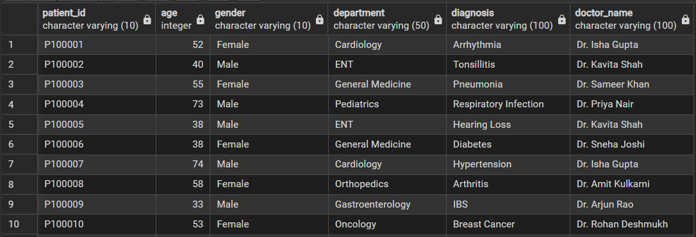

### 💡 Insight

The joined output provides patient demographics, department, diagnosis, and assigned doctor for each admission. This creates a consolidated view that can be used to analyze patient care and doctor workload.

---

## 7. Top 5 Doctors by Number of Admissions

### 📝 SQL Problem

Find the top 5 doctors who handled the highest number of admissions.

This analysis helps understand the distribution of admission workload among doctors.

### 💻 Solution Query

```sql
SELECT
    COUNT(a.admission_id) AS total_admissions,
    d.doctor_name
FROM admissions AS a
INNER JOIN doctors AS d
    ON a.doctor_id = d.doctor_id
GROUP BY d.doctor_name
ORDER BY total_admissions DESC
LIMIT 5;
```

### 📤 Output

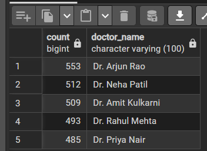

### 💡 Insight

Dr. Arjun Rao handled the highest number of admissions with 553, followed by Dr. Neha Patil (512) and Dr. Amit Kulkarni (509). The results show differences in admission workload among doctors.

---

## 8. Insurance Provider Cost and Coverage Analysis

### 📝 SQL Problem

For each insurance provider, calculate:

- Total medical expenses
- Total insurance coverage
- Average insurance coverage
- Remaining patient expense

This analysis evaluates insurance contribution and the remaining expense that patients need to bear.

### 💻 Solution Query

```sql
SELECT
    insurance_provider,
    ROUND(SUM(medical_expenses), 2) AS total_medical_expense,
    ROUND(SUM(insurance_coverage), 2) AS total_insurance_coverage,
    ROUND(AVG(insurance_coverage), 2) AS avg_insurance_coverage,
    ROUND(
        SUM(medical_expenses) - SUM(insurance_coverage),
        2
    ) AS remaining_expense
FROM admissions
GROUP BY insurance_provider
ORDER BY remaining_expense DESC;
```

### 📤 Output

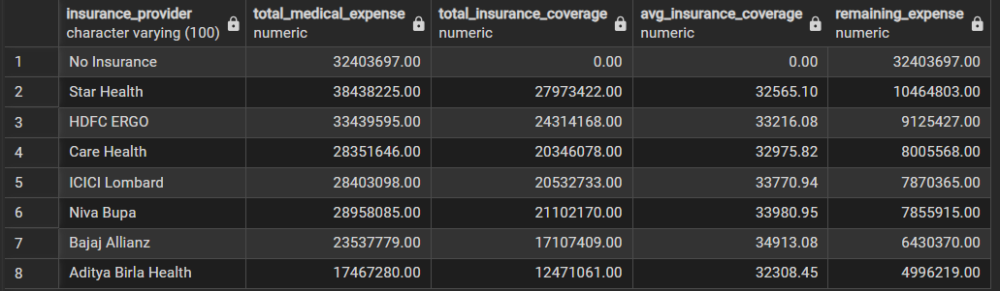

### 💡 Insight

Star Health has the highest total medical expenses at ₹38.43 million and insurance coverage of ₹27.97 million. Patients without insurance have the largest remaining expense because their ₹32.41 million in medical expenses has no recorded insurance coverage.

---

## 9. Readmission Rate by Department

### 📝 SQL Problem

Calculate the readmission rate for each department and identify the department with the highest readmission rate.

Readmission rate is calculated as:

```text
Readmission Rate =
(Number of Readmitted Patients / Total Admissions) × 100
```

### 💻 Solution Query

```sql
SELECT
    department,
    COUNT(*) AS total_admissions,
    COUNT(
        CASE
            WHEN readmission = 'Yes' THEN 1
        END
    ) AS total_readmissions,
    ROUND(
        COUNT(
            CASE
                WHEN readmission = 'Yes' THEN 1
            END
        ) * 100.0 / COUNT(*),
        2
    ) AS readmission_rate
FROM admissions
GROUP BY department
ORDER BY readmission_rate DESC
LIMIT 1;
```

### 📤 Output

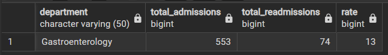

### 💡 Insight

Gastroenterology recorded 74 readmissions out of 553 admissions, resulting in a 13% readmission rate. This metric can help identify departments where follow-up care and readmission management may require attention.

---

## 10. Top 5 Laboratory Tests by Total Cost

### 📝 SQL Problem

Find the top 5 laboratory tests based on total testing cost.

Show:

- Number of tests
- Total test cost
- Average test cost

### 💻 Solution Query

```sql
SELECT
    test_name,
    COUNT(*) AS total_test,
    ROUND(SUM(test_cost), 2) AS total_test_cost,
    ROUND(AVG(test_cost), 2) AS avg_test_cost
FROM lab_tests
GROUP BY test_name
ORDER BY total_test_cost DESC
LIMIT 5;
```

### 📤 Output

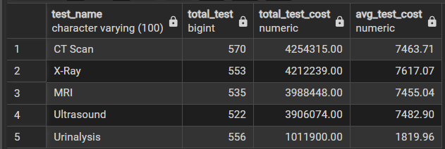

### 💡 Insight

CT Scan generated the highest total testing cost at approximately ₹4.25 million, followed by X-Ray at ₹4.21 million. These tests also have relatively high average costs compared with Ultrasound and Urinalysis.

---

# 🔴 Advanced Level

## 11. Top 3 Diagnoses Within Each Department

### 📝 SQL Problem

Find the top 3 most common diagnoses within each department and assign a rank to each diagnosis.

### 💻 Solution Query

```sql
WITH ranked AS
(
    SELECT
        department,
        diagnosis,
        COUNT(diagnosis) AS total_diagnosis_per_department,
        ROW_NUMBER() OVER(
            PARTITION BY department
            ORDER BY COUNT(diagnosis) DESC
        ) AS rnk
    FROM admissions
    GROUP BY department, diagnosis
)

SELECT
    *
FROM ranked
WHERE rnk <= 3;
```

### 📤 Output

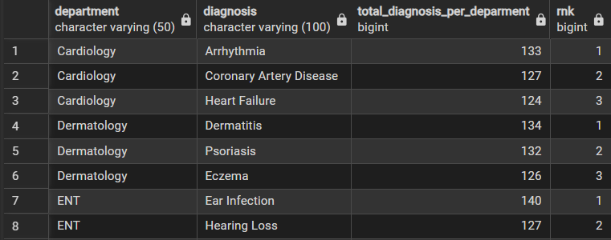

### 💡 Insight

The results show that common diagnoses vary by department. For example, Arrhythmia is the most common Cardiology diagnosis with 133 cases, while Ear Infection leads ENT with 140 cases.


---

## 12. Patients with Above-Average Total Medical Expenses

### 📝 SQL Problem

Find patients whose total medical expenses are greater than the average total medical expense across all patients.

The analysis first calculates the total expense for each patient and then compares each patient against the overall average patient-level expense.

### 💻 Solution Query

```sql
WITH patient_expense AS
(
    SELECT
        patient_id,
        SUM(medical_expenses) AS total_expense
    FROM admissions
    GROUP BY patient_id
)

SELECT
    patient_id,
    total_expense,
    ROUND(
        (
            SELECT AVG(total_expense)
            FROM patient_expense
        ),
        2
    ) AS avg_expense
FROM patient_expense
WHERE total_expense >
(
    SELECT
        AVG(total_expense)
    FROM patient_expense
);
```

### 📤 Output

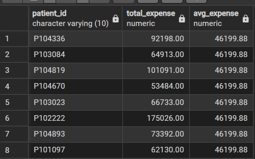

### 💡 Insight

The average total medical expense per patient is ₹46,199.88. Patients shown in the output have expenses above this benchmark, with some patients accumulating substantially higher costs, such as ₹175,026.

---

## 13. Monthly Medical Expenses and Month-over-Month Change

### 📝 SQL Problem

Calculate the total medical expenses for each month and compare each month with the previous month, showing the month-over-month change.

The month-over-month rate is calculated as:

```text
MoM Rate =
(Current Month Expense - Previous Month Expense)
/
Previous Month Expense × 100
```

### 💻 Solution Query

```sql
SELECT
    EXTRACT(MONTH FROM admission_date) AS month,

    SUM(medical_expenses) AS total_expenses,

    LAG(
        SUM(medical_expenses),
        1
    ) OVER(
        ORDER BY EXTRACT(MONTH FROM admission_date)
    ) AS previous_month_total_expense,

    ROUND(
        (
            SUM(medical_expenses)
            -
            LAG(
                SUM(medical_expenses),
                1
            ) OVER(
                ORDER BY EXTRACT(MONTH FROM admission_date)
            )
        )
        /
        LAG(
            SUM(medical_expenses),
            1
        ) OVER(
            ORDER BY EXTRACT(MONTH FROM admission_date)
        ),
        2
    ) * 100 AS mom

FROM admissions
GROUP BY 1
ORDER BY 1;
```

### 📤 Output

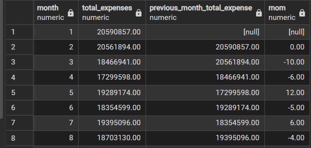

### 💡 Insight

Medical expenses decreased from February through April, followed by a 12% increase in May. Expenses then decreased by 5% in June and 4% in August, showing month-to-month fluctuations rather than a consistent upward or downward trend.

---

## 14. Department Performance Report

### 📝 SQL Problem

Create a department performance report containing:

- Total admissions
- Average length of stay
- Total medical expenses
- Average patient satisfaction
- Readmission rate

Rank departments based on total medical expenses.

### 💻 Solution Query

```sql
SELECT
    department,

    COUNT(*) AS total_admissions,

    AVG(length_of_stay) AS avg_length_of_stay,

    SUM(medical_expenses) AS total_medical_expenses,

    AVG(patient_satisfaction) AS avg_patient_satisfaction,

    COUNT(
        CASE
            WHEN readmission = 'Yes'
            THEN 1
        END
    ) AS total_readmissions,

    ROUND(
        COUNT(
            CASE
                WHEN readmission = 'Yes'
                THEN 1
            END
        ) * 100.0 / COUNT(*),
        2
    ) AS readmission_rate,

    ROW_NUMBER() OVER(
        ORDER BY SUM(medical_expenses) DESC
    ) AS rank

FROM admissions
GROUP BY department;
```

### 📤 Output

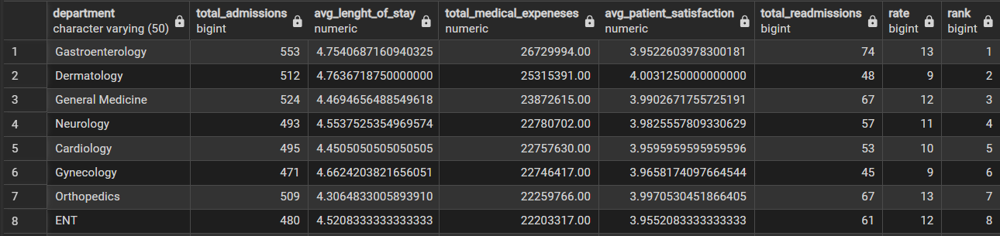

### 💡 Insight

Gastroenterology ranks first in total medical expenses with approximately ₹26.73 million and also has the highest admission volume among the displayed departments at 553. Its 13% readmission rate also indicates an area worth monitoring alongside its overall workload.

---

## 15. Department Requiring the Most Attention

### 📝 SQL Problem

Identify the department that requires the most attention from hospital management by analyzing:

- Admission volume
- Emergency admission percentage
- Average length of stay
- Medical expenses
- Readmission rate
- Patient satisfaction
- Laboratory costs

A custom analytical attention score is used to combine these metrics.

### 💻 Solution Query

```sql
WITH department_metrics AS (
    SELECT
        department,

        COUNT(*) AS admission_volume,

        ROUND(
            COUNT(
                CASE
                    WHEN admission_type = 'Emergency'
                    THEN 1
                END
            ) * 100.0 / COUNT(*),
            2
        ) AS emergency_percentage,

        ROUND(
            AVG(length_of_stay),
            2
        ) AS avg_length_of_stay,

        ROUND(
            SUM(medical_expenses),
            2
        ) AS total_medical_expenses,

        ROUND(
            COUNT(
                CASE
                    WHEN readmission = 'Yes'
                    THEN 1
                END
            ) * 100.0 / COUNT(*),
            2
        ) AS readmission_rate,

        ROUND(
            AVG(patient_satisfaction),
            2
        ) AS avg_satisfaction,

        ROUND(
            COALESCE(SUM(l.test_cost), 0),
            2
        ) AS total_lab_cost

    FROM admissions a

    LEFT JOIN lab_tests l
        ON a.admission_id = l.admission_id

    GROUP BY department
),

scored_departments AS (
    SELECT
        *,

        (
            admission_volume
            + emergency_percentage
            + avg_length_of_stay
            + total_medical_expenses / 10000
            + readmission_rate
            + (10 - avg_satisfaction)
            + total_lab_cost / 10000
        ) AS attention_score

    FROM department_metrics
)

SELECT
    *,
    RANK() OVER(
        ORDER BY attention_score DESC
    ) AS attention_rank

FROM scored_departments
ORDER BY attention_rank;
```

### 📤 Output

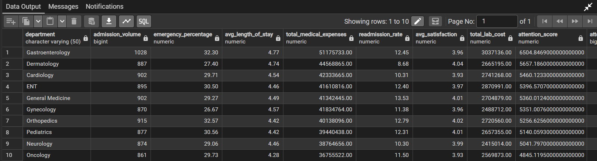

### 💡 Insight

Gastroenterology ranks first with an attention score of 3,585.72. It has the highest admission volume (553), highest total medical expenses (₹26.73 million), and a 13.38% readmission rate. These combined indicators suggest that Gastroenterology has a relatively high workload and should be closely monitored for resource utilization and patient outcomes.

---

# 📈 Key Metrics

The analysis focuses on important healthcare KPIs such as:

- **Total Patients**
- **Total Admissions**
- **Average Patient Age**
- **Average Length of Stay**
- **Emergency Admission Percentage**
- **Total Medical Expenses**
- **Total Insurance Coverage**
- **Remaining Patient Expense**
- **Readmission Rate**
- **Patient Satisfaction**
- **Total Laboratory Costs**
- **Average Laboratory Test Cost**
- **Department Attention Score**

---

# 🔍 Key Business Insights

The analysis provides a clear overview of patient demographics, hospital workload, healthcare costs, laboratory usage, and department performance.

1. **Gastroenterology** recorded the highest admission volume with **553 admissions** and the highest total medical expenses of approximately **₹26.73 million**.

2. **Elective admissions** represented the largest share of hospital admissions at **45.48%**, while Emergency and Urgent admissions accounted for **29.68%** and **24.84%**, respectively.

3. **Dermatology** had the highest average medical expense per admission at approximately **₹49,444**, indicating relatively higher costs per admission compared with other departments.

4. **CT Scan** had the highest total laboratory testing cost at approximately **₹4.25 million**, followed closely by X-Ray at **₹4.21 million**.

5. **Gastroenterology ranked first in the custom department attention score (3,585.72)**, driven by its high admission volume, medical expenses, readmission rate, and other operational metrics.

---

# 💡 Business Recommendations

Based on the analysis, hospital management can consider the following strategies:

1. **Monitor Gastroenterology closely** because it has the highest admission volume, total medical expenses, and attention score.

2. **Review high-cost departments and treatments**, particularly areas such as Dermatology where the average medical expense per admission is relatively high.

3. **Monitor readmission patterns** in departments with higher readmission rates and review whether additional follow-up or patient-care measures are required.

4. **Review laboratory expenditure**, especially high-cost tests such as CT Scans and X-Rays, to better understand testing demand and associated costs.

5. **Track monthly admissions and expenses** to identify significant fluctuations and support better resource, staffing, and financial planning.
---

# 📁 Project Structure

```text
healthcare-data-analysis/
│
├── data/
│   ├── healthcare_patients.csv
│   ├── healthcare_doctors.csv
│   ├── healthcare_admissions_5000.csv
│   └── healthcare_lab_tests_8000.csv
│
├── sql/
│   └── healthcare_analysis.sql
│
├── images/
│   ├── q1_output.png
│   ├── q2_output.png
│   ├── q3_output.png
│   ├── q4_output.png
│   ├── q5_output.png
│   ├── q6_output.png
│   ├── q7_output.png
│   ├── q8_output.png
│   ├── q9_output.png
│   ├── q10_output.png
│   ├── q11_output.png
│   ├── q12_output.png
│   ├── q13_output.png
│   ├── q14_output.png
│   └── q15_output.png
│
├── README.md
│
└── healthcare_dataset_5000.xlsx
```

---

# 🚀 How to Run the Project

## 1. Clone the Repository

```bash
git clone https://github.com/your-username/healthcare-data-analysis.git
```

Move into the project directory:

```bash
cd healthcare-data-analysis
```

---

## 2. Install PostgreSQL

Install PostgreSQL and pgAdmin 4 on your system.

Create a new PostgreSQL database for the project.

Example:

```text
Database Name:
citycare_hospital
```

---

## 3. Create the Database Tables

Open the SQL file:

```text
sql/healthcare_analysis.sql
```

Run the table creation queries in PostgreSQL.

The tables created are:

```text
patients
doctors
admissions
lab_tests
```

---

## 4. Load the Healthcare Dataset

Import the following CSV files into their respective PostgreSQL tables:

```text
healthcare_patients.csv
        ↓
patients

healthcare_doctors.csv
        ↓
doctors

healthcare_admissions_5000.csv
        ↓
admissions

healthcare_lab_tests_8000.csv
        ↓
lab_tests
```

The tables should be populated in the following order:

```text
1. patients
2. doctors
3. admissions
4. lab_tests
```

This order ensures that the foreign key relationships can be maintained correctly.

---

## 5. Verify the Data

After importing the datasets, verify the records using:

```sql
SELECT *
FROM patients;

SELECT *
FROM doctors;

SELECT *
FROM admissions;

SELECT *
FROM lab_tests;
```

You can also check the number of records:

```sql
SELECT COUNT(*) FROM patients;

SELECT COUNT(*) FROM doctors;

SELECT COUNT(*) FROM admissions;

SELECT COUNT(*) FROM lab_tests;
```

Expected record counts:

```text
Patients       → 5,000
Doctors        → 12
Admissions     → 5,000
Lab Tests      → 8,000
```

---

## 6. Run the SQL Analysis

Open:

```text
sql/healthcare_analysis.sql
```

Execute the queries from:

```text
Basic Level
    ↓
Intermediate Level
    ↓
Advanced Level
```

The project contains 15 healthcare business questions covering different levels of SQL analysis.

---

# 📚 SQL Concepts Used

This project demonstrates the use of several SQL concepts, including:

- `SELECT`
- `WHERE`
- `GROUP BY`
- `ORDER BY`
- `HAVING`
- `LIMIT`
- Aggregate Functions
- `COUNT()`
- `SUM()`
- `AVG()`
- `ROUND()`
- `CASE`
- Conditional Aggregation
- `INNER JOIN`
- `LEFT JOIN`
- Subqueries
- Common Table Expressions (`CTE`)
- `WITH`
- `DATE_TRUNC()`
- `EXTRACT()`
- Window Functions
- `LAG()`
- `RANK()`
- `ROW_NUMBER()`
- `PARTITION BY`
- Percentage Calculations
- Month-over-Month Analysis
- Patient-level Aggregation
- Department-level Aggregation
- Custom Analytical Scoring

---

# 🧠 Skills Demonstrated

### Database & SQL

- **PostgreSQL**
- SQL Query Writing
- Database Design
- Primary Keys
- Foreign Keys
- Table Relationships
- Joins
- Aggregations
- Conditional Aggregation
- Subqueries
- Common Table Expressions
- Window Functions
- Ranking
- Date Functions
- Business Problem Solving

### Data Analysis

- Patient Demographic Analysis
- Hospital Admission Analysis
- Medical Expense Analysis
- Insurance Analysis
- Doctor Workload Analysis
- Readmission Analysis
- Laboratory Cost Analysis
- Department Performance Analysis
- Trend Analysis
- Month-over-Month Analysis

### Business Analysis

- KPI Analysis
- Healthcare Operations Analysis
- Cost Analysis
- Resource Planning
- Department Performance Evaluation
- Data-Driven Recommendations
- Analytical Scoring

### Other

- **Git**
- **GitHub**
- Documentation
- Data-driven Decision Making
- Business Problem Solving

---

# 📌 Conclusion

This project demonstrates an end-to-end **healthcare data analytics workflow using PostgreSQL and SQL**, starting from structured healthcare data and progressing through database creation, relational data analysis, SQL business problems, and business insights.

The project analyzes multiple aspects of hospital operations including **patient demographics, admissions, doctors, medical expenses, insurance coverage, readmissions, laboratory testing, and department performance.**

The use of SQL techniques such as **aggregations, joins, conditional logic, subqueries, CTEs, date functions, and window functions** allows healthcare data to be transformed into meaningful information for hospital management.

The project demonstrates how SQL can be used to move from:

```text
Raw Healthcare Data
        ↓
Database
        ↓
SQL Analysis
        ↓
Healthcare KPIs
        ↓
Business Insights
        ↓
Management Recommendations
```

Overall, this project demonstrates the practical application of SQL for solving real-world business and operational problems in a healthcare environment.

---

## 👩‍💻 Author

**Tasneem Shaikh**

**Data Analytics | SQL | PostgreSQL | Python | Pandas | Power BI**
